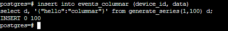

## Task Part 1 - Introduction to Data Warehouse

### 1. Perbedaan antara data warehouse dan data lake:

	Data Warehouse:
	•	Menyimpan data terstruktur dan terorganisir.
	•	Cocok untuk analisis bisnis dan pelaporan.
	•	Memerlukan transformasi data sebelum dimuat.
	•	Biasanya kurang skalabel dan lebih mahal.

	Data Lake:
	•	Menyimpan data dalam berbagai format, termasuk data mentah.
	•	Cocok untuk analisis yang lebih luas, termasuk Big Data dan kecerdasan buatan.
	•	Tidak memerlukan transformasi data sebelum penyimpanan.
	•	Lebih fleksibel dan lebih ekonomis.
	Pilihan tergantung pada jenis data dan jenis analisis yang dibutuhkan. Data Warehouse lebih sesuai untuk data terstruktur dan analisis bisnis, sementara Data Lake lebih cocok untuk data beraneka ragam dan analisis yang lebih luas.


### 2. Perbedaan database untuk data warehouse (OLAP) dan database konvensional (OLTP):

	Teknologi Database OLAP (Data Warehouse):
	•	Tujuan Utama: Digunakan untuk analisis dan pelaporan data untuk mendukung pengambilan keputusan bisnis.
	•	Desain Skema: Biasanya menggunakan skema bintang atau snowflake yang mendukung struktur data yang optimal untuk analisis.
	•	Volume Data: Mengelola volume data yang besar dengan kueri kompleks dan agregasi data.
	•	Kueri Complex: Mendukung kueri kompleks yang melibatkan agregasi, penggabungan data, dan pemrosesan berat.
	•	Latensi Data: Toleran terhadap latensi data yang lebih tinggi karena data biasanya tidak selalu real-time.

	Teknologi Database Konvensional (OLTP):
	•	Tujuan Utama: Digunakan untuk memproses transaksi bisnis sehari-hari, seperti penjualan atau pembaruan inventaris.
	•	Desain Skema: Menggunakan skema relasional untuk memastikan integritas data dan efisiensi transaksi.
	•	Volume Data: Mengelola volume data yang lebih rendah dibandingkan dengan OLAP.
	•	Kueri Sederhana: Menangani kueri sederhana dengan tingkat latensi yang sangat rendah.
	•	Latensi Data: Menyediakan data real-time untuk mendukung transaksi bisnis.


### 3. Teknologi yang biasanya dipakai untuk data warehouse:
	•	AWS Redshift
	•	Google Big Query
	•	Clickhouse
	•	Snowflake
	•	Databricks
	•	Apache Dorris
	•	Postgre (with Citus extension)


### 4. Tuliskan setiap perintah dari proses instalasi citus menggunakan docker compose sampai tabel terbentuk, berikan juga tangkapan layar untuk setiap langkah dan hasilnya! 

#### a) Membuat direktori terbaru bernama 'try-citus' dan navigasi ke direktori tersebut.
```
mkdir try-citus
cd try-citus
```


#### b) Menggunakan editor teks untuk menciptakan dokumen baru bernama 'docker-compose.yml'.
```
vi docker-compose.yml
```


#### c) Paste isi file yang telah disalin dari repositori Citus di GitHub ke dalam dokumen baru 'docker-compose.yml' yang baru dibuat, lalu melakukan penyesuaian pada beberapa variabel.

master:
- container_name: "citus_master"
- ports: ["5500:5432"]

master environment:
- POSTGRES_USER: "mysuperuser"
- POSTGRES_PASSWORD: "superpass123"
- PGUSER: "myuser"
- PGPASSWORD: "pass123"
- POSTGRES_HOST_AUTH_METHOD: "trust"

manager:
- container_name: "citus_manager"


#### d) Setelah melakukan modifikasi, menyimpan dokumen dan menjalankan perintah docker-compose dalam mode latar belakang dengan menggunakan nama proyek 'citus'.
```
docker-compose -p citus up -d
```


#### e) Memeriksa apakah wadah yang dibuat berjalan dengan baik.
```
docker ps
```


#### f) Mengakses terminal bash di dalam container citus_master.
```
docker exec -it citus_master bash
```


#### g) Terhubung ke sistem PostgreSQL menggunakan nama akun 'mysuperuser' dan basis data 'postgres'.
```
psql -U mysuperuser -d postgres
```


#### h) Buat ekstensi citus
```
create extension citus;
```


#### i) Membuat tabel 'events_columnar' dengan menggunakan metode penyimpanan columnar
```
create table events_columnar (
	device_id bigint,
	event_id bigserial,
	event_time timestamptz default now(),
	data jsonb not null
)
using columnar;
```


#### j) Menambahkan data ke dalam tabel yang baru dibuat.
```
insert into events_columnar (device_id, data)
select d, '{"hello":"columnar"}' from generate_series(1,100) d;
```


#### k) Membuat tabel 'events_row' sebagai alternatif dari tabel yang telah ada untuk keperluan perbandingan.
```
create table events_row as select * from events_columnar;
```


#### l) Menampilkan sepuluh baris data dari masing-masing tabel.
```
select * from events_columnar limit 10;
```

```
select * from events_row limit 10;
```


#### m) Menampilkan informasi terperinci mengenai struktur tabel.
```
\dt+
```


### 5. Perbedaan access method heap dan columnar:
	Access Method "Heap":
	•	Penyimpanan Data: Data disimpan dalam format heap mirip dengan database PostgreSQL biasa.
	•	Struktur Data: Tabel diatur dalam format baris (row-based), seperti pada database relasional biasa.
	•	Performa Tulis: Cocok untuk operasi penulisan (INSERT, UPDATE) yang sering.
	•	Kueri Selektif: Lebih baik untuk kueri yang memilih sedikit kolom dari banyak baris.
	•	Ukuran Database: Biasanya menghasilkan ukuran database yang lebih besar karena data disimpan dalam format baris.

	Access Method "Columnar":
	•	Penyimpanan Data: Data disimpan dalam format kolom, dengan kolom-kolom yang terpisah.
	•	Struktur Data: Tabel diatur dalam format kolom (columnar), yang lebih efisien untuk kueri analitik.
	•	Performa Kueri: Cocok untuk kueri yang memerlukan agregasi dan analisis data dengan selektivitas tinggi.
	•	Kueri Selektif: Dapat memproses kueri yang memilih sebagian besar atau semua kolom dari sejumlah kecil baris.
	•	Ukuran Database: Biasanya menghasilkan ukuran database yang lebih kecil karena data disimpan dalam format kolom.

