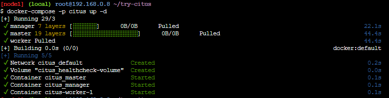
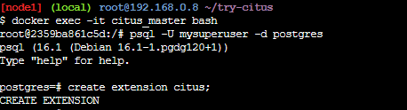
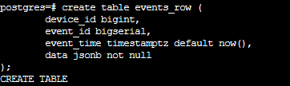
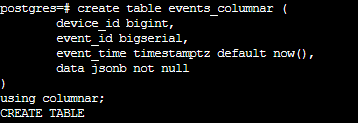
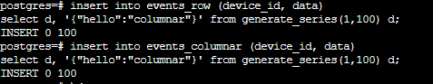
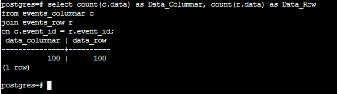
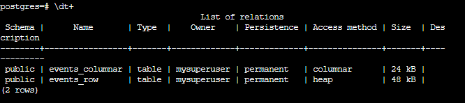

## Task Part 2 - Columnar Database

### 1. Jalankan Citus di komputer lokal dengan menggunakan docker compose!
```
docker-compose -p citus up -d
```




### 2. Tuliskan perintah untuk membuat:
#### a. tabel biasa
```
create table events_row (
	device_id bigint,
	event_id bigserial,
	event_time timestamptz default now(),
	data jsonb not null
);
```


#### b. Columnar tabel
```
create table events_columnar (
	device_id bigint,
	event_id bigserial,
	event_time timestamptz default now(),
	data jsonb not null
)
using columnar;
```


### 3. Masukkan 100 baris data ke dalam tabel biasa dan tabel columnar!
```
insert into events_row (device_id, data)
select d, '{"hello":"columnar"}' from generate_series(1,100) d;
```
```
insert into events_columnar (device_id, data)
select d, '{"hello":"columnar"}' from generate_series(1,100) d;
```




### 4. Tampilkan perbedaan ukuran antara tabel biasa dan tabel columnar!
```
\dt+
```
#### Memiliki Jumlah Ukuran yang sama antara tabel biasa/heap & columnar


### 5. Tuliskan Kesimpulan!
		• Tabel Biasa (Heap): Tabel biasa di Citus memiliki struktur yang mirip dengan
		database PostgreSQL biasa, dengan data disimpan dalam format baris. Tabel ini
		lebih cocok untuk operasi penulisan yang sering dan kueri yang memilih sedikit
		kolom dari banyak baris. Namun, ukuran database biasanya lebih besar.
		
		• Tabel Columnar: Tabel columnar di Citus memiliki struktur yang mengorganisir
		data dalam format kolom terpisah, yang sangat efisien untuk kueri analitik. 
		Tabel ini lebih cocok untuk kueri yang memerlukan agregasi, analisis data dengan 
		selektivitas tinggi, dan memproses kueri yang memilih banyak kolom dari
		sejumlah kecil baris. Ini dapat menghasilkan ukuran database yang lebih kecil.

	Pilihan antara keduanya bergantung pada jenis operasi dan kueri yang akan
	dieksekusi dalam konteks aplikasi atau penggunaan tertentu. Data biasa lebih cocok
	untuk operasi penulisan yang sering, sementara tabel columnar lebih cocok untuk
	analisis data dan kueri yang selektif. Penyesuaian harus didasarkan pada prioritas
	performa yang diperlukan dalam kasus penggunaan yang spesifik.
