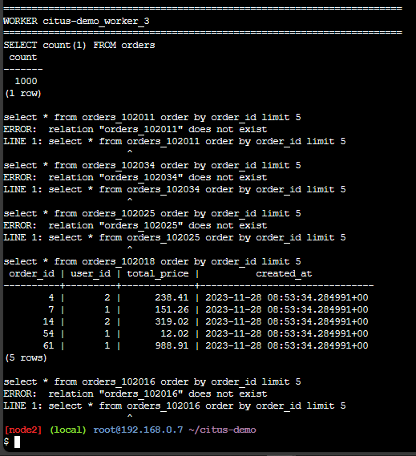

## Task Part 3 - Replication + Sharding

### 1. Jelaskan perbedaan antara replication dan sharding!
#### Replication

  • Redundansi Data: Replication melibatkan menyalin data dari satu server database ke server lain, menciptakan salinan yang identik dari data.
  • Failover dan Ketersediaan: Replication membantu meningkatkan ketersediaan dengan menyediakan salinan cadangan data jika salah satu server mengalami kegagalan. Ini mengurangi downtime.
  • Latensi Rendah: Kueri dapat diarahkan ke server lokal yang berisi salinan data, menghasilkan latensi yang rendah untuk akses baca.
  • Skalabilitas Terbatas: Replication biasanya tidak menyebabkan skalabilitas horizontal (menambahkan server secara linier) karena data ada di semua server.

#### Sharding

  • Pemecahan Data: Sharding melibatkan membagi data menjadi potonganpotongan kecil (shard) dan mendistribusikannya ke berbagai server. Setiap server hanya berisi sebagian data.
  • Skalabilitas Horizontal: Sharding meningkatkan skalabilitas horizontal dengan menambahkan server saat data tumbuh, memungkinkan peningkatan kapasitas dan kinerja.
  • Ketersediaan Tergantung Desain: Ketersediaan dalam sharding tergantung pada bagaimana sistem dirancang, dan beberapa solusi mungkin memerlukan upaya lebih lanjut untuk mencapai failover yang efektif.
  • Latensi Variabel: Kueri mungkin mengalami latensi yang bervariasi tergantung pada lokasi shard yang dipanggil.

### 2. Lakukan percobaan pada repo [citus-demo](https://github.com/Immersive-DataEngineer-Resource/citus-demo)!

#### a) Clone repositori dan masuk ke direktori 'citus-demo'.
```
git clone https://github.com/Immersive-DataEngineer-Resource/citus-demo.git
cd citus-demo
```


#### b) Menjalankan reset.sh
```
./reset.sh
```


#### c) Menjalankan docker compose dan tunggu hingga semua worker siap.
```
docker compose up -d
```


#### d) Menjalankan populate.sh
```
./populate.sh
```


#### 5) Menjalankan inspect.sh
```
./inspect.sh
```




### 3. Di node/worker mana saja product "Headphone" tersimpan? Tunjukkan shard id nya!
```
select shardid as shard_id, nodename as node_name from pg_dist_shard_placement
  where shardid = (select get_shard_id_for_distribution_column('products', (select product_id from products
  where "name" = 'Headphones')));
```

- product headphone dengan shard id 102009 ada di node/worker 1, 2, dan 3 karena table products tidak di distribute melainkan di replicate. Sehingga tiap node memiliki data products yang sama.
- untuk mengetahui di shard mana suatu data tertentu akan disimpan, bisa menggunakan fungsi ```get_shard_id_for_distribution_column``` dengan parameter ```(<nama_tabel>, <id/kolom_distribusi>)```
- untuk menemukan di node mana suatu shardid disimpan, bisa menggunakan query:
```
select * from pg_dist_shard_placement
where shardid = <shard_id>
```
- untuk mengetahui id headphones, menggunakan query:
```
select product_id from products
where "name" = 'Headphones'
```

### 4. Di node/worker mana saja order dengan id 13 tersimpan? Tunjukkan shard id nya!
```
select shardid as shard_id, nodename as node_name from pg_dist_shard_placement
  where shardid = (select get_shard_id_for_distribution_column('orders', 13));
```

- order dengan id 13 hanya ada di node/worker 3 dengan shard id 102033 karena tabel orders di distribute berdasarkan order_id yang sudah dibuat sequence sebelumnya sehingga setiap order_id pasti hanya terdapat di salah satu node/worker.

### 5. Kapan sebaiknya kita menggunakan replication?
Replication sebaiknya digunakan ketika memerlukan:
  • Ketersediaan tinggi dan ketahanan terhadap kegagalan server.
  • Salinan data yang terdistribusi secara geografis.
  • Pengurangan latensi baca dan peningkatan kinerja.
  • Distribusi lalu lintas baca untuk penyeimbangan beban.
  • Lingkungan pengujian dan pengembangan yang serupa dengan produksi.

Ini membantu dalam situasi di mana data tidak boleh hilang dan sistem perlu
beroperasi dengan minimnya gangguan.


### 6. Kapan sebaiknya kita menggunakan sharding?
Sharding sebaiknya digunakan ketika Anda menghadapi:
  • Pertumbuhan data yang cepat.
  • Kinerja tinggi yang diperlukan.
  • Kebutuhan pengelolaan data yang terdistribusi.
  • Kehadiran global yang memerlukan akses data dekat pengguna.
  • Batasan kapasitas server tunggal.
  • Keinginan untuk memisahkan data pelanggan atau unit bisnis.

Sharding membantu dalam meningkatkan kapasitas, kinerja, dan pengelolaan data
dalam skenario seperti ini.
