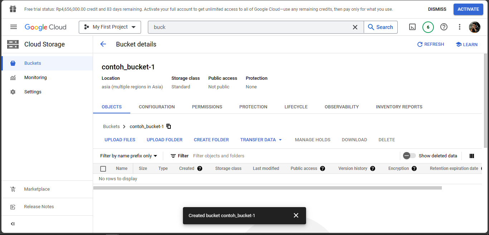
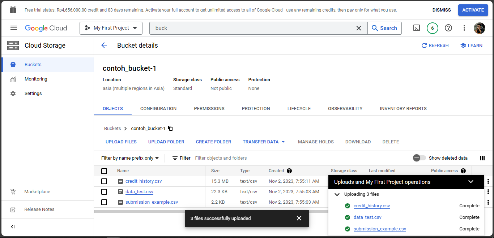
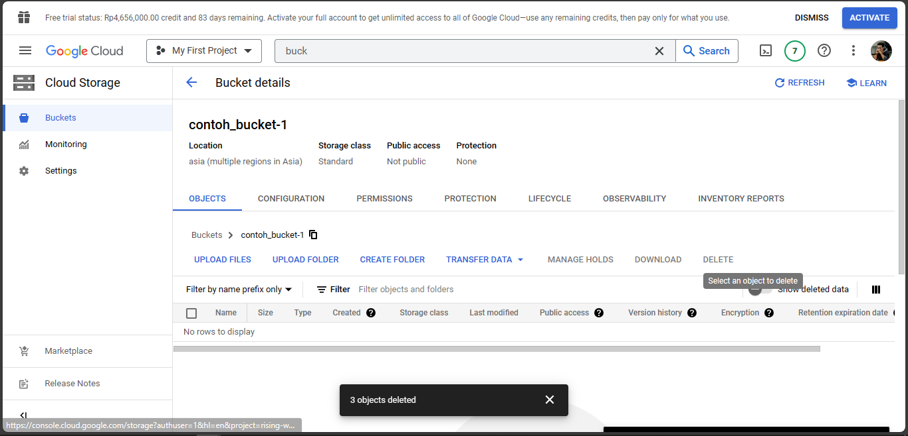
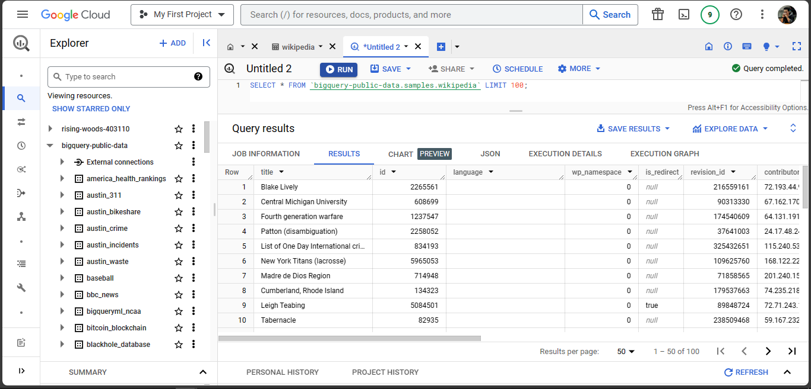
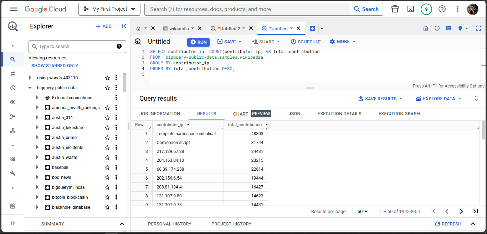

## Task Part 4 - Google Cloud Storage

### 1. Buat sebuah bucket di GCS, upload beberapa file ke bucket tersebut!

#### • Membuat Bucket

#### • Upload beberapa file

### 2. Hapus file yang sudah diupload

### 3. Lakukan eksplorasi sample data wikipedia dengan menggunakan Big Query

### 4. Munculkan jumlah kontribusi dari masing-masing contributor_ip, urutkan dari kontribusi terbesar ke kontribusi terkecil

#### • Link Query
https://console.cloud.google.com/bigquery?sq=643092235437:9f4606295fd8433881075d03af2f157c

